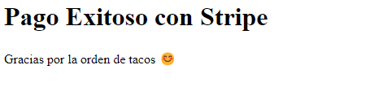

#PAGOS ONLINE CON API DE STRIPE

En este ejercicio se utilizó la API de la plataforma de Stripe para realizar pagos con Tarjeta. 
Como actualmente no está disponible en Argentina se usó la moneda de México.
Por cuestión se seguridad no muestro las claves de uso de Stripe, así que muestor el código y fotos de como funciona el uso de la API.

-Primero se selecciona uno de los productos:

-Con producto seleccionado se llena los datos de la tarjeta:

-Si el pago fue exitoso aparecerá el siguiente mensaje:

